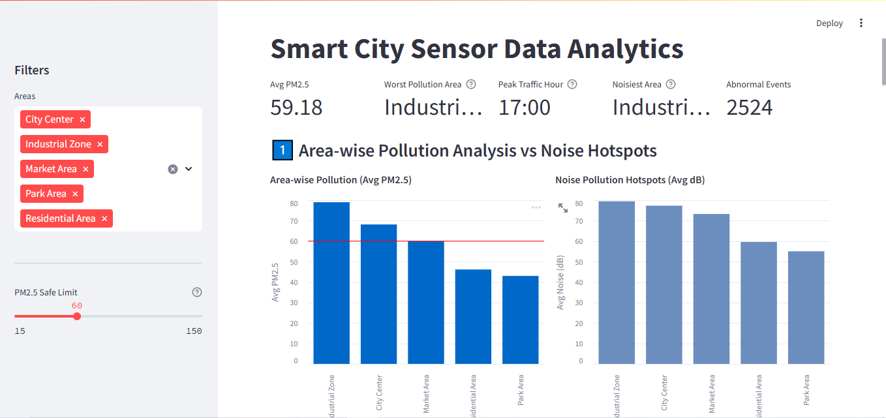
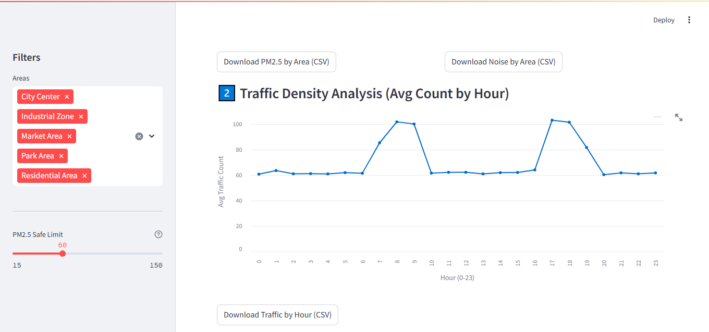
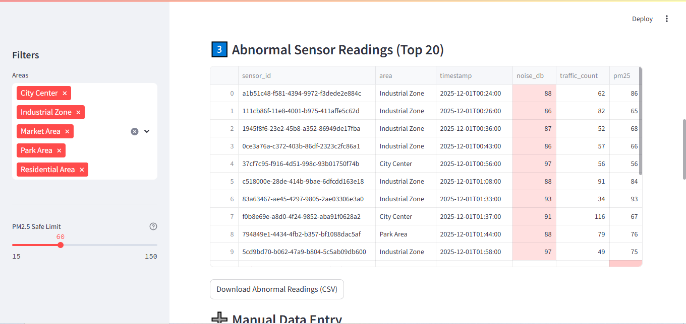
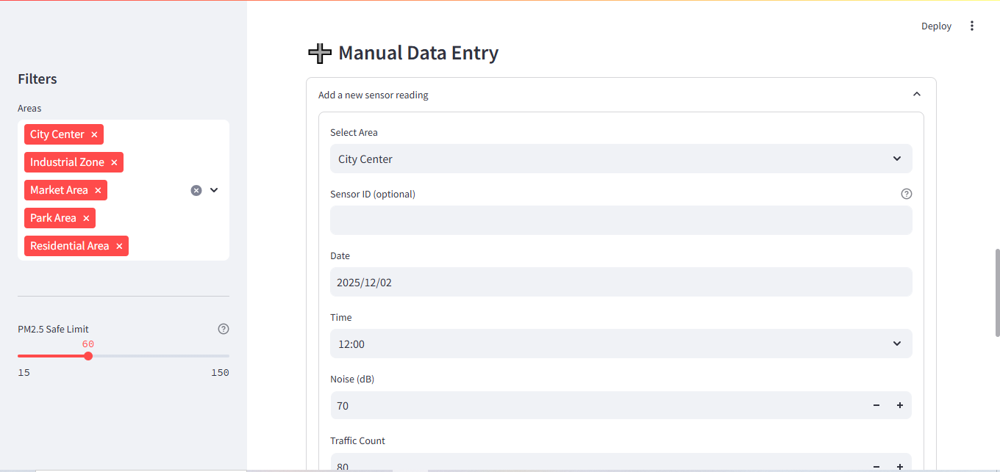
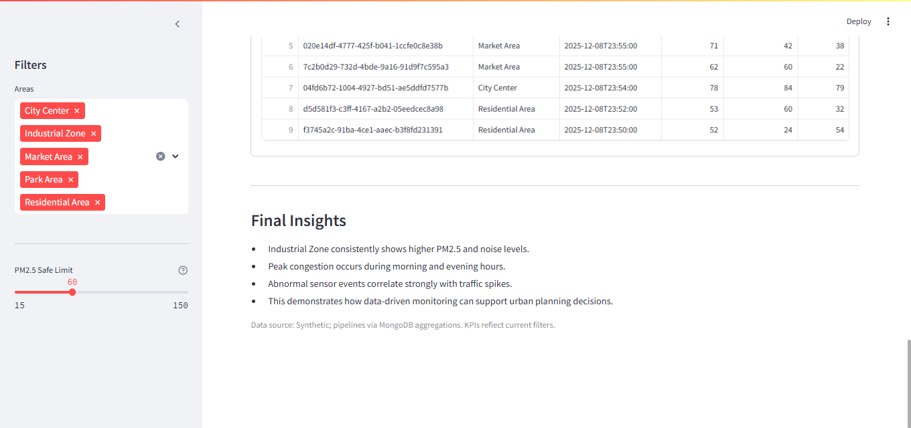

# Smart City Sensor Data Analytics Using MongoDB and Streamlit

Analyze large-scale synthetic Smart City IoT sensor data to identify area-wise pollution trends, traffic peak periods, noise pollution hotspots, and abnormal readings.

## Project Structure

```
smart-city-analytics/
├── data/
│   └── generate_sensor_data.py
├── db/
│   └── mongo_setup.py
├── analytics/
│   └── analysis.py
├── dashboard/
│   └── app.py
├── requirements.txt
└── README.md
```


## Tools & Technologies
- Python, pandas
- MongoDB + PyMongo
- Streamlit

## Screenshots






## Steps to Run

1. Create and activate a Python environment, then install dependencies:
```powershell
python -m venv .venv
.\.venv\Scripts\Activate.ps1
pip install -r smart-city-analytics/requirements.txt
```

2. Generate synthetic data (10k records by default):
```powershell
python smart-city-analytics/data/generate_sensor_data.py --output smart-city-analytics/data/sensor_data.json --records 10000
```

3. Ensure MongoDB is running locally (or set `MONGODB_URI`). Insert data:
```powershell
python smart-city-analytics/db/mongo_setup.py --uri mongodb://localhost:27017 --file smart-city-analytics/data/sensor_data.json
```

4. Run the Streamlit dashboard:
```powershell
$env:MONGODB_URI = "mongodb://localhost:27017"
streamlit run smart-city-analytics/dashboard/app.py
```

## No MongoDB Installed? Quick Options

- Docker (fastest, if you have Docker Desktop):
```powershell
docker run --name mongo -p 27017:27017 -d mongodb/mongodb-community-server:7.0-ubuntu2204
```
Then use `mongodb://localhost:27017` as the URI.

- MongoDB Atlas (free cloud):
	- Create a free cluster at https://www.mongodb.com/atlas
	- Add your IP to Network Access (0.0.0.0/0 for testing only)
	- Create a database user
	- Get the connection string and set in PowerShell:
```powershell
$env:MONGODB_URI = "mongodb+srv://<user>:<pass>@<cluster>/"
```
	- Re-run the setup and dashboard steps.

- Local install (Windows MSI):
	- Download MongoDB Community Server from https://www.mongodb.com/try/download/community
	- Install and start the MongoDB service
	- Use `mongodb://localhost:27017`

## Analytics Explained
- Area-wise average PM2.5: Groups by `area` and averages `pm25` to reveal pollution patterns.
- Traffic density by hour: Converts `timestamp` to date, extracts hour, and averages `traffic_count` to show peaks.
- Average noise level by area: Groups by `area` to compute average `noise_db` indicating hotspots.
- Abnormal readings: Filters records where `noise_db > 85` or `traffic_count > 150` or `pm25 > 100` and displays them.

All analytics are implemented with MongoDB aggregation pipelines. See `analytics/analysis.py` and the queries in `dashboard/app.py`.

## Performance Notes
- Indexes were created on `area` and `timestamp` to improve query performance on large datasets, especially for group-by and time-based aggregations.

## Grader Checklist (Rubric → Evidence)
- End-to-end pipeline: Data generation (`data/generate_sensor_data.py`) → Mongo ingest (`db/mongo_setup.py`) → analytics (`analytics/analysis.py`) → dashboard (`dashboard/app.py`).
- Big data concepts: Aggregation pipelines ($group, $project, $addFields/$toDate, $hour), indexes on query keys.
- Analytics coverage: Area PM2.5, Noise hotspots, Traffic-by-hour, Abnormal readings, KPI cards.
- Interactivity: Sidebar filters, CSV exports, safe-limit overlay, manual data entry with immediate visibility.
- Performance: Indexes + caching; clear notes and troubleshooting guidance.
- Documentation: Runnable commands, environment setup, alternatives (Docker/Atlas), and final insights.

## Architecture Diagram
```
[ Synthetic Data Generator ]
	|  JSON Lines (sensor_data.json)
	v
[ MongoDB (smart_city.sensor_data) ]
	|  PyMongo (indexes, batch insert)
	v
[ Analytics Pipelines ]  -- $group / $project / $match / $hour
	|  results (dict/list)
	v
[ Streamlit Dashboard ]
    - KPI cards
    - PM2.5 & Noise charts (Altair)
    - Traffic by hour (Altair)
    - Abnormal readings table
    - Manual insert form + recent inserts
```

## Academic Notes
- No authentication or CRUD UI.
- No frontend frameworks; Streamlit only.
- No machine learning; focus on big data analytics concepts.
- Code is clear and commented for easy viva explanations.

## Troubleshooting
- If `streamlit run` fails to connect, verify `MONGODB_URI` and that data is inserted.
- If `pymongo` date conversions fail, ensure timestamps are ISO strings (generated by the data script).
